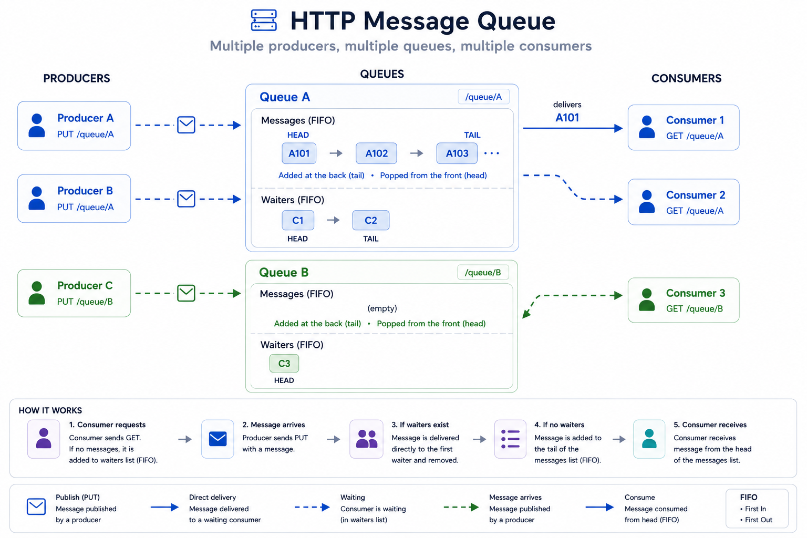
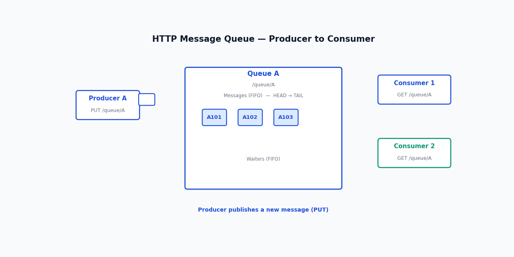

# HTTP Message Queue

A lightweight in-memory HTTP message queue written in Go.

The server exposes a simple REST API that allows clients to enqueue and dequeue messages from named queues. If a queue is empty, consumers can either wait indefinitely for new messages or specify a timeout for long polling.

## Overview



## Features

- Named queues created automatically on first use
- FIFO message delivery
- Blocking dequeue with optional timeout
- Thread-safe implementation
- No external dependencies

## Demo



## Building

```bash
go build
```

## Running

```bash
go run . --port 8080
```

The default port is `8080`.

## API

### Enqueue a message

Adds a message to the specified queue.

```http
PUT /{queue}?v={message}
```

Example:

```bash
curl -X PUT "http://localhost:8080/tasks?v=hello"
```

Response:

```
200 OK
```

---

### Dequeue a message

Retrieves the next available message from the specified queue.

```http
GET /{queue}
```

Behavior:

- If the queue contains a message, it is returned immediately.
- If the queue is empty and `timeout` is specified, the request waits up to the given number of seconds for a new message.
- If the queue is empty and `timeout` is omitted, the request waits indefinitely until:
  - a message becomes available, or
  - the client closes the connection.
- If the timeout expires before a message arrives, the server responds with:

```
404 Not Found
```

Examples:

Wait indefinitely:

```bash
curl "http://localhost:8080/tasks"
```

Wait up to 10 seconds:

```bash
curl "http://localhost:8080/tasks?timeout=10"
```

---

## Example

Start a consumer:

```bash
curl "http://localhost:8080/jobs?timeout=30"
```

In another terminal, enqueue a message:

```bash
curl -X PUT "http://localhost:8080/jobs?v=Build%20completed"
```

The waiting consumer immediately receives:

```
Build completed
```

## Implementation Details

### Queue Storage

Messages are stored in Go's `container/list`, which implements a doubly linked list.

A doubly linked list was chosen because the queue only needs to:

- append messages to the back (`PushBack`)
- remove messages from the front (`Front` + `Remove`)

Both operations run in **O(1)** time and do not require shifting elements, making the data structure a natural fit for a FIFO queue.

For a production implementation, a slice backed by a ring buffer would generally be a better choice. It offers the same **O(1)** enqueue and dequeue operations while providing better cache locality and lower memory overhead.

A doubly linked list was intentionally chosen here for learning and demonstration purposes. It keeps the queue logic straightforward and clearly illustrates FIFO behavior without introducing the additional implementation details required for a ring buffer.

## Project Structure

```text
.
├── main.go
├── broker.go
├── queue.go
└── http.go
```

## Notes

- Messages are stored entirely in memory.
- Queues are created automatically when the first message is enqueued.
- Each message is delivered to exactly one consumer.
- Multiple producers and consumers are supported concurrently.
- This project is intended as a minimal example of implementing a concurrent in-memory message queue in Go using mutexes, channels, and contexts.
